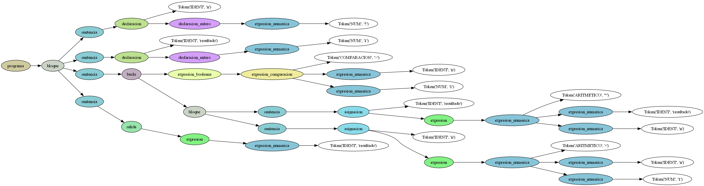
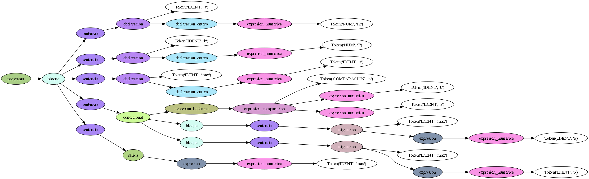

# Caracteristicas de los lenguajes de programación
## Trabajo práctico final

### Descripcion del lenguaje de programación 
 **Amapola** es un lenguaje de programación simple, de propósito general, inspirado en los lenguajes imperativos. Cuenta con tipado estático y admite dos tipos de datos: enteros y booleanos. Permite trabajar con estructuras de control como condicionales y bucles. Su característica principal es el uso de **notación polaca binaria** (prefija), donde los operadores se escriben antes de sus dos operandos.

### Uso de la notacion polaca
Este lenguaje sólo admite el uso de la notacion prefija, (es decir, que no maneja la notacion infija de los lenguajes convencionales ni la notacion postfija), esto quiere decir que cualquier operacion sea aritmetica como logica tiene que estructurarse con el operador al principio y sus dos operandos después. Esta notación permite beneficios a la hora de ser procesada por el parser dado que posee reglas gramaticales más simples.

#### Operaciones aritméticas
|Notacion infija| Notacion prefija (Amapola) |
|----------------|-----------------|
| 3 + 5 | + 3 5 | 
| 8 * 4 | * 8 4 |
| 4 + 11 / 2 | + 4 / 11 2 |
| (7 - 3) * (2 + 4) | * - 7 3 + 2 4 | 

#### Operaciones lógicas

|Notacion infija| Notacion prefija (Amapola) |
|----------------|-----------------|
| VERDADERO & FALSO | & VERDADERO FALSO | 
| ! VERDADERO | ! VERDADERO |
|(x == 5) & (y /= 2) | & == x 5 /= y 2 |
| !(x > y) | ! > x y |

### Variables
Las variables tienen que ser declaradas con su tipo de dato (ENTERO o BOOLEANO) y su valor (que puede ser un entero, un booleano o una expresión). Además, los identificadores solamente pueden usar letras minúsculas con números, guiones bajos o guiones comunes (de manera que solamente se permite el uso de **snake_case** o **kebab_case**).
#### Declaración
```pascal
VAR x ENTERO = 10;
VAR y BOOLEANO = VERDADERO;
VAR z BOOLEANO = & y > x 0; 
```
#### Asignación
```pascal
y = 10;
x = - y 5;  
```
### Control de flujo
#### Condicional
Se permite la selección con una sentencia del tipo IF-THEN-ELSE que, en este caso, sigue la estructura de SI:(condicion) ENTONCES:(sentencia) pudiendo incluir SINO.
```pascal
VAR resultado ENTERO = 0;
VAR condicion BOOLEANO = > y x;
SI: & condicion z ENTONCES:
    resultado = 1;
SINO:
    resultado = 2;
;

```
#### Bucle
Similar a WHILE-DO, se sigue la estructura MIENTRAS: (condicion) HACER: (sentencia)  
```pascal
VAR contador ENTERO = 0;
MIENTRAS: > x 0 HACER:
    contador = + contador 1;
    x = - x 1;
;
```
### Salida
**Amapola** no posee funciones que retornen valores, pero tiene una forma de imprimir los resultados de las operaciones con **SALIDA**, que funciona como un print en Python. 

```pascal
SALIDA: contador;
SALIDA: + contador 5;
SALIDA: < contador 0;
```

### BNF
```bnf
<programa> ::= "INICIO:" <bloque> "FIN"

<bloque> ::= <sentencia> | <sentencia> <bloque> | λ

<sentencia> ::= <declaracion> ";" | <condicional> ";" | <bucle> ";" | <asignacion> ";" | <salida> ";"
<salida> ::= "SALIDA:" <expresion>
<condicional> ::= "SI:" <expresion_booleana> "ENTONCES:" <bloque>
                | "SI:" <expresion_booleana> "ENTONCES:" <bloque> "SINO:" <bloque>
<bucle> ::= "MIENTRAS:" <expresion_booleana> "HACER:" <bloque>

<asignacion> ::= <identificador> <op_asignacion> <expresion>
<expresion> ::= <expresion_numerica> | <expresion_booleana>

<declaracion> ::= "VAR" <identificador> <declaracion_entero>
                | "VAR" <identificador> <declaracion_booleano>

<declaracion_entero> ::= "ENTERO" <op_asignacion> <expresion_numerica>
<declaracion_booleano> ::= "BOOLEANO" <op_asignacion> <expresion_booleana>

<expresion_booleana> ::= <booleano>
                       | <identificador>
                       | <op_logico> <expresion_booleana> <expresion_booleana>
                       | <op_negacion> <expresion_booleana>
                       | <expresion_comparacion>

<expresion_numerica> ::= <entero>
                       | <identificador>
                       | <op_aritmetico> <expresion_numerica> <expresion_numerica>

<expresion_comparacion> ::= <op_comparacion> <expresion_numerica> <expresion_numerica>

<identificador> ::= <digito>
                  | <letra>
                  | <guion>
                  | <digito> <identificador>
                  | <letra> <identificador>
                  | <guion> <identificador>

<op_asignacion> ::= "="
<op_comparacion> ::= "==" | "/=" | ">" | "<" 
<op_logico> ::= "&" | "|"
<op_negacion> ::= "!"
<op_aritmetico> ::= "+" | "-" | "/" | "*" | "%"
<booleano> ::= "VERDADERO" | "FALSO"
<digito> ::= "0" | "1" | "2" | "3" | "4" | "5" | "6" | "7" | "8" | "9"
<letra> ::= "a" | ... | "z"
<guion> ::= "-" | "_"
```

### Ejemplos
#### Factorial
```pascal
INICIO:
VAR n ENTERO = 5;
VAR resultado ENTERO = 1;

MIENTRAS: > n 1 HACER:
    resultado = * resultado n;
    n = - n 1;
;
SALIDA: resultado;
FIN

```

#### Mayor entre dos numeros
```pascal
INICIO:
VAR a ENTERO = 12;
VAR b ENTERO = 7;
VAR max ENTERO = a;

SI: < b a ENTONCES:
    max = a;
SINO:
    max = b;
;

SALIDA: max;
FIN
```

### Clasificación

| Criterio | Descripcion |
|--|--|
|Paradigma| Imperativo |
|Nivel de abstraccion| alto |
| Dominio| General, pero con usos didácticos |
| Tipo de traductor | Podría compilarse |
| Almacenamiento de variables | Estático |
| Forma de abordar las tareas| Operativo |
| Concurrencia | No soportada |
| Recursión | No soportada |
| Realizacion visual | Textual |
| Caracteristicas utiles o productivas | Útil, no esotérico |


